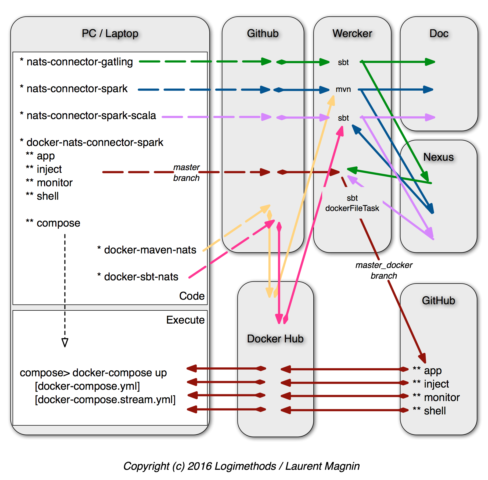

# docker-nats-connector-spark
A collection of Docker Images to illustrate the use of the [nats-connector-spark](https://github.com/Logimethods/nats-connector-spark), [nats-connector-spark-scala](https://github.com/Logimethods/nats-connector-spark-scala) & [nats-connector-gatling](https://github.com/Logimethods/nats-connector-gatling) librairies.

[](http://opensource.org/licenses/MIT)
[](https://github.com/Logimethods/docker-nats-connector-spark/issues)
[](https://app.wercker.com/project/bykey/ae3458297bed4e5921beaba70acf173b)

[](https://hub.docker.com/r/logimethods/nats-connector-spark/)

## Usage
    cd compose
    docker-compose up

## What it does...
1) Docker-compose will instantiate and run a collection of Docker Containers defined by [docker-compose.yml](https://github.com/Logimethods/docker-nats-connector-spark/blob/master/compose/docker-compose.yml)

2) Gatling does emit every 15 sec a stream of values from 100 to 150 into NATS. See [NatsInjection.scala](https://github.com/Logimethods/docker-nats-connector-spark/blob/master/inject/user-files/simulations/nats/NatsInjection.scala).

3) Those values are transmitted from NATS to Spark Streaming (running on a Spark cluster), then the maximum value of each stream is computed by Spark & reemited into NATS. See [SparkProcessor.scala](https://github.com/Logimethods/docker-nats-connector-spark/blob/master/app/src/main/scala/com/logimethods/nats/connector/spark/app/SparkProcessor.scala)

4) Finally, those values are monitored and printed into the console. See [NatsOutputMonitor.scala](https://github.com/Logimethods/docker-nats-connector-spark/blob/master/monitor/src/main/scala/com/logimethods/nats/connector/spark/monitor/NatsOutputMonitor.scala)


## Build

Those Docker Images are pushed to [dockerhub:logimethods/nats-connector-spark](https://hub.docker.com/r/logimethods/nats-connector-spark/) and build there.



## Release Notes
### Version 0.1.0
* Spark is based on version 1.5.2 so to be able to use docker-compose without hostname constrains.

### Version 0.2.0
* To be able to use Spark version 1.6.2, docker-compose containers need to belong to an external network (which enforce a hostname without underscore). See [Switch to using hyphens as a separator in hostnames](https://github.com/docker/compose/issues/229):
```
$ docker network create spark
```
`docker-compose.yml`:
```
...
networks:
  default:
    external:
      name: spark
```

## Links
* [nats-connector-gatling on Github](https://github.com/Logimethods/nats-connector-gatling)
* [nats-connector-spark on Github](https://github.com/Logimethods/nats-connector-spark)
* [nats-connector-spark-scala on Github](https://github.com/Logimethods/nats-connector-spark-scala)
* [docker-nats-connector-spark on Github](https://github.com/Logimethods/docker-nats-connector-spark)
* [nats-connector-gatling build on Wercker](https://app.wercker.com/logimethods/nats-connector-gatling)
* [logimethods/maven-nats on Github](https://hub.docker.com/r/logimethods/maven-nats/builds/)
* [nats-connector-spark build on Wercker](https://app.wercker.com/logimethods/nats-connector-spark)
* [logimethods/sbt-nats on Github](https://hub.docker.com/r/logimethods/sbt-nats/builds/)
* [nats-connector-spark-scala build on Wercker](https://app.wercker.com/logimethods/nats-connector-spark-scala/)
* [logimethods on Nexus](https://oss.sonatype.org/#nexus-search;quick~logimethods)
* [docker-nats-connector-spark build on Wercker](https://app.wercker.com/logimethods/docker-nats-connector-spark)
* [nats-connector-spark on Docker Hub](https://hub.docker.com/r/logimethods/nats-connector-spark/)

## Outcome (digest)
```
compose$ docker-compose up
spark-master is up-to-date
spark-slave2 is up-to-date
nats-main is up-to-date
spark-slave1 is up-to-date
Recreating compose_monitor_1
Recreating main-app
Recreating compose_gatling_1
Attaching to spark-master, spark-slave2, nats-main, spark-slave1, main-app, compose_gatling_1, compose_monitor_1
main-app        | Will process messages from INPUT to OUTPUT
gatling_1       | GATLING_HOME is set to /opt/gatling
main-app        | SPARK_MASTER_URL = spark://spark-master:7077
spark-master    | 16/07/11 18:13:55 INFO Master: Registered signal handlers for [TERM, HUP, INT]
main-app        | 16/07/13 14:03:10 INFO SparkContext: Running Spark version 1.5.2
spark-slave2    | 16/07/11 18:13:54 INFO Worker: Registered signal handlers for [TERM, HUP, INT]
nats-main       | [1] 2016/07/11 18:13:53.495906 [INF] Starting nats-server version 0.8.1
spark-slave2    | 16/07/11 18:13:56 INFO Remoting: Starting remoting
spark-slave2    | 16/07/11 18:13:57 INFO Remoting: Remoting started; listening on addresses :[akka.tcp://sparkWorker@172.20.0.4:37988]
spark-slave2    | 16/07/11 18:13:57 INFO Utils: Successfully started service 'sparkWorker' on port 37988.
spark-master    | 16/07/11 18:13:58 INFO Remoting: Starting remoting
spark-master    | 16/07/11 18:13:58 INFO Utils: Successfully started service 'sparkMaster' on port 7077.
spark-master    | 16/07/11 18:13:58 INFO Remoting: Remoting started; listening on addresses :[akka.tcp://sparkMaster@spark-master:7077]
spark-master    | 16/07/11 18:13:58 INFO Master: Starting Spark master at spark://spark-master:7077
spark-master    | 16/07/11 18:13:58 INFO Master: Running Spark version 1.5.2
spark-master    | 16/07/11 18:13:59 INFO Utils: Successfully started service 'MasterUI' on port 8080.
spark-master    | 16/07/11 18:13:59 INFO MasterWebUI: Started MasterWebUI at http://172.20.0.3:8080
spark-master    | 16/07/11 18:13:59 INFO Utils: Successfully started service on port 6066.
spark-master    | 16/07/11 18:13:59 INFO StandaloneRestServer: Started REST server for submitting applications on port 6066
spark-master    | 16/07/11 18:14:05 INFO Master: Registering app NATS Data Processing
spark-master    | 16/07/11 18:14:05 INFO Master: Registered app NATS Data Processing with ID app-20160711181405-0000
nats-main       | [1] 2016/07/11 18:13:53.495988 [INF] Starting http monitor on :8222
spark-slave2    | 16/07/11 18:13:57 INFO Worker: Starting Spark worker 172.20.0.4:37988 with 4 cores, 8.7 GB RAM
main-app        | 16/07/13 14:03:11 INFO Remoting: Remoting started; listening on addresses :[akka.tcp://sparkDriver@172.20.0.8:37838]
main-app        | 16/07/13 14:03:11 INFO Utils: Successfully started service 'sparkDriver' on port 37838.
main-app        | 16/07/13 14:03:11 INFO AppClient$ClientEndpoint: Connecting to master spark://spark-master:7077...
main-app        | 16/07/13 14:03:12 INFO SparkDeploySchedulerBackend: Connected to Spark cluster with app ID app-20160713140311-0001
nats-main       | [1] 2016/07/11 18:13:53.496144 [INF] Listening for route connections on 0.0.0.0:6222
nats-main       | [1] 2016/07/11 18:13:53.496196 [INF] Listening for client connections on 0.0.0.0:4222
nats-main       | [1] 2016/07/11 18:13:53.496236 [INF] Server is ready
nats-main       | [1] 2016/07/11 18:23:47.824141 [INF] Starting nats-server version 0.8.1
spark-master    | 16/07/11 18:23:51 INFO Remoting: Remoting started; listening on addresses :[akka.tcp://sparkMaster@spark-master:7077]
spark-master    | 16/07/11 18:23:51 INFO Utils: Successfully started service 'sparkMaster' on port 7077.
spark-master    | 16/07/11 18:23:51 INFO Master: Starting Spark master at spark://spark-master:7077
spark-master    | 16/07/11 18:23:52 INFO Master: I have been elected leader! New state: ALIVE
spark-slave2    | 16/07/11 18:13:57 INFO WorkerWebUI: Started WorkerWebUI at http://172.20.0.4:8081
spark-slave2    | 16/07/11 18:13:57 INFO Worker: Connecting to master spark-master:7077...
main-app        | 16/07/13 14:03:12 INFO AppClient$ClientEndpoint: Executor added: app-20160713140311-0001/0 on worker-20160713140115-172.20.0.4-41459 (172.20.0.4:41459) with 4 cores
main-app        | 16/07/13 14:03:12 INFO SparkDeploySchedulerBackend: Granted executor ID app-20160713140311-0001/0 on hostPort 172.20.0.4:41459 with 4 cores, 1024.0 MB RAM
spark-master    | 16/07/11 18:32:23 INFO Master: Registered app NATS Data Processing with ID app-20160711183223-0000
main-app        | 16/07/13 14:03:12 INFO SparkContext: Added JAR /app/nats-connector-spark-0.1.0.jar at http://172.20.0.8:46335/jars/nats-connector-spark-0.1.0.jar with timestamp 1468418592350
main-app        | NATS_URI = nats://nats-main:4222
spark-slave1    | 16/07/11 18:14:03 INFO Worker: Connecting to master spark-master:7077...
spark-slave1    | 16/07/11 18:14:04 INFO Worker: Successfully registered with master spark://spark-master:7077
spark-slave2    | 16/07/11 18:14:07 INFO Worker: Successfully registered with master spark://spark-master:7077
spark-slave2    | 16/07/11 18:14:08 INFO Worker: Asked to launch executor app-20160711181405-0000/1 for NATS Data Processing
monitor_1       | Will be listening to messages from OUTPUT
main-app        | -------------------------------------------
main-app        | Time: 1468418602000 ms
main-app        | -------------------------------------------
main-app        | 
gatling_1       | Simulation com.logimethods.nats.demo.NatsInjection started...
gatling_1       | Will emit messages to INPUT
gatling_1       | 
gatling_1       | ================================================================================
gatling_1       | 2016-07-13 14:03:31                                           0s elapsed
gatling_1       | ---- NATS call -----------------------------------------------------------------
gatling_1       | [                                                                          ]  0%
gatling_1       |           waiting: 900    / active: 0      / done:0     
gatling_1       | ---- Requests ------------------------------------------------------------------
gatling_1       | > Global                                                   (OK=0      KO=0     )
gatling_1       | 
gatling_1       | ================================================================================
gatling_1       | 
main-app        | -------------------------------------------
main-app        | Time: 1468418612000 ms
main-app        | -------------------------------------------
main-app        | 140
main-app        | 
monitor_1       | Received message: 140
main-app        | -------------------------------------------
main-app        | Time: 1468418614000 ms
main-app        | -------------------------------------------
main-app        | 150
main-app        | 
monitor_1       | Received message: 150
gatling_1       | 
gatling_1       | ================================================================================
gatling_1       | 2016-07-13 14:03:36                                           5s elapsed
gatling_1       | ---- NATS call -----------------------------------------------------------------
gatling_1       | [######                                                                    ]  8%
gatling_1       |           waiting: 825    / active: 0      / done:75    
gatling_1       | ---- Requests ------------------------------------------------------------------
gatling_1       | > Global                                                   (OK=0      KO=0     )
gatling_1       | 
gatling_1       | ================================================================================
gatling_1       | 
main-app        | -------------------------------------------
main-app        | Time: 1468418618000 ms
main-app        | -------------------------------------------
main-app        | 150
main-app        | 
monitor_1       | Received message: 150
...
```

## License

(The MIT License)

Copyright (c) 2016 Logimethods.

Permission is hereby granted, free of charge, to any person obtaining a copy
of this software and associated documentation files (the "Software"), to
deal in the Software without restriction, including without limitation the
rights to use, copy, modify, merge, publish, distribute, sublicense, and/or
sell copies of the Software, and to permit persons to whom the Software is
furnished to do so, subject to the following conditions:

The above copyright notice and this permission notice shall be included in
all copies or substantial portions of the Software.

THE SOFTWARE IS PROVIDED "AS IS", WITHOUT WARRANTY OF ANY KIND, EXPRESS OR
IMPLIED, INCLUDING BUT NOT LIMITED TO THE WARRANTIES OF MERCHANTABILITY,
FITNESS FOR A PARTICULAR PURPOSE AND NONINFRINGEMENT. IN NO EVENT SHALL THE
AUTHORS OR COPYRIGHT HOLDERS BE LIABLE FOR ANY CLAIM, DAMAGES OR OTHER
LIABILITY, WHETHER IN AN ACTION OF CONTRACT, TORT OR OTHERWISE, ARISING
FROM, OUT OF OR IN CONNECTION WITH THE SOFTWARE OR THE USE OR OTHER DEALINGS
IN THE SOFTWARE.
